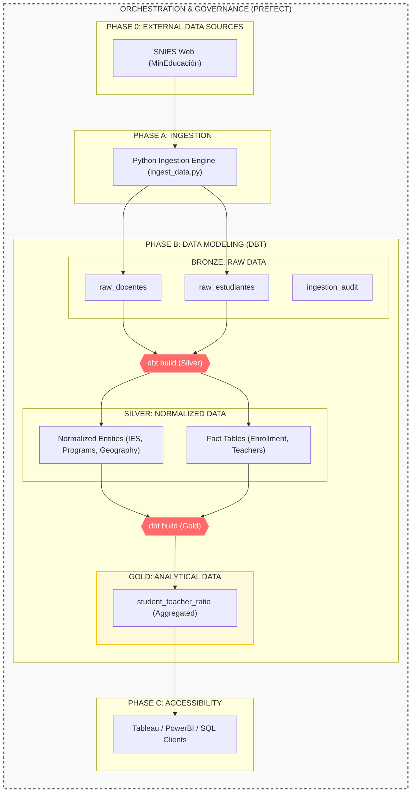

# 🎓 SNIES Data Challenge: Bogotá HEI Monitor

Automated data platform built to monitor the academic capacity of Higher Education Institutions (HEIs) in Bogotá using **SNIES Open Data**. This project implements a full ETL lifecycle—from raw file extraction to analytical reporting—utilizing modern data engineering practices.

---

## 📖 Table of Contents
1. [🚀 Quick Start](#quick-start)
2. [📊 System Architecture](#system-architecture)
3. [📐 Data Architecture (Medallion)](#data-architecture-medallion)
4. [⚙️ Pipeline Orchestration](#pipeline-orchestration)
5. [🖥 Operational Guide](#operational-guide)
6. [📊 Observability & Visualization (Grafana)](#-observability--visualization-grafana)
7. [🔌 Connectivity & External Tools](#connectivity--external-tools)
8. [🚀 Future Roadmap](#future-roadmap)
9. [🤖 AI-Powered Development](#ai-powered-development)
10. [📂 Project File Reference](#project-file-reference)

---

## 🚀 Quick Start

Get the entire environment up and running in minutes.

### Prerequisites
- **Docker & Docker Compose** installed.
- (Windows Users) **WSL 2 Integration** enabled in Docker Desktop.

### 1. Configure Credentials
The system uses **Docker Secrets** for secure management. Create the secrets directory and define your database credentials:
```bash
mkdir -p secrets
echo "snies_user" > secrets/db_user
echo "snies_password" > secrets/db_password
```

### 2. Launch Infrastructure
```bash
docker compose up -d --build
```
*Wait for containers to initialize (Postgres and Prefect).*

### 3. Trigger the Pipeline
Execute the full flow (Extraction → Ingestion → Transformation):
```bash
docker exec snies-challenge-orchestrator-1 python /orchestration/flows/etl_flow.py
```

### 4. Verify results
- **Prefect Dashboard**: [http://localhost:4200](http://localhost:4200)
- **Grafana Dashboard**: [Live Dashboard](http://localhost:3000/d/857298ea-10f9-41b2-9481-f0e0b3257782/snies-gold-table-dashboard?orgId=1&from=2022-01-01T00:00:00.000Z&to=2024-07-01T00:00:00.000Z&timezone=browser&refresh=1m)
- **dbt Documentation**: [http://localhost:8080](http://localhost:8080) (See [Operational Guide](#-operational-guide) to start the server)

---

## 📊 System Architecture

The project follows a modular design where **Prefect** governs the execution flow and **dbt** handles the logic within the database.



---

## 📐 Data Architecture (Medallion)

We implement a three-layer architecture to ensure data quality, consistency, and analytical performance.

### 🟤 Bronze Layer (Raw)
- **Structure**: Nearly identical to the source Excel/CSV files.
- **Purpose**: Serves as a raw landing zone. Data is ingested "as-is" to maintain a faithful history.
- **Storage**: `bronze` schema.

### 🥈 Silver Layer (Normalized)
- **Model**: **Snowflake Schema** (3NF).
- **Purpose**: Enforces data integrity and relationship consistency across entities (Institutions, Geography, Programs).
- **Storage**: `silver` schema.

### 🥇 Gold Layer (Aggregated)
- **Model**: **Star Schema**.
- **Purpose**: Optimized for BI. Contains pre-calculated metrics like the **Student-to-Teacher Ratio**.
- **Storage**: `gold` schema.

> [!TIP]
> **Data Traceability**: Traceability is guaranteed by **dbt lineage**. Every row can be traced back to its specific source file via the [`ingestion_audit`](./dbt_project/models/bronze/ingestion_audit.sql) table.

---

## ⚙️ Pipeline Orchestration

The pipeline consists of four intelligent stages orchestrated by **Prefect**:

### 1. Raw Data Acquisition
- **Mechanism**: High-performance Bash script [`./scripts/get_data.sh`](./scripts/get_data.sh).
- **Feature**: Detects existing files in the local directory to avoid redundant downloads.

### 2. Intelligent File Filtering
- **Logic**: Uses [`./orchestration/flows/ingestion_config.json`](./orchestration/flows/ingestion_config.json) to decide what to process.
- **Criteria**: Matches file prefixes (e.g., `docentes`) and specific years (e.g., 2022-2024). It also checks the `ingestion_audit` table to skip already processed files.

### 3. Ingestion Engine
- **Mechanism**: Python script [`./scripts/ingest_data.py`](./scripts/ingest_data.py) using Pandas/SQLAlchemy.
- **Capabilities**: Handles heterogeneous formats (`.xlsx`, `.xlsb`, `.csv`), detects header offsets, and manages multi-sheet workbooks dynamically.

### 4. Transformation & Quality (dbt)
- **Logic**: Moves data through Medallion layers using SQL.
- **Quality**: Runs automated **dbt tests** to validate types, nulls, and business rules (e.g., Bogotá-only filtering).

---

## 🖥 Operational Guide

### 🔍 Monitoring with Prefect
Access the dashboard at [http://localhost:4200](http://localhost:4200):
- **Runs**: View real-time logs and task status.
- **Flows**: Inspect the DAG and execution history.

### 📖 Data Documentation (dbt)
To visualize the data lineage and schema definitions:
1.  **Start the server**:
    ```bash
    docker exec -w /dbt_project snies-challenge-orchestrator-1 dbt docs serve --port 8080 --host 0.0.0.0
    ```
2.  **Access the UI**: [http://localhost:8080](http://localhost:8080)

### 🛠 Tech Stack
- **Database:** PostgreSQL (OLAP)
- **Orchestration:** Prefect
- **Data Transformation:** dbt-core
- **Ingestion:** Python (Pandas + SQLAlchemy)
- **Visualization & Observability:** Grafana
- **DevOps:** Docker & Docker Compose

---

## 📊 Observability & Visualization (Grafana)

While not a traditional BI tool, **Grafana** was chosen as a lightweight solution for data visualization and real-time observability. It offers a simple, low-hardware consumption alternative to monitor the pipeline's final output without the overhead of heavy enterprise BI platforms.

### Data Insight
The implemented dashboard consumes data directly from the **Gold Layer**, providing a clear view of the student-to-teacher ratio metrics for Bogotá HEIs.

> [!IMPORTANT]
> **Data Dependency**: The dashboard will remain empty until the Prefect pipeline has been successfully executed at least once, popifying the `gold` schema tables.

### Accessing the Dashboard
- **Direct Link**: [SNIES Gold Table Dashboard](http://localhost:3000/d/857298ea-10f9-41b2-9481-f0e0b3257782/snies-gold-table-dashboard?orgId=1&from=2022-01-01T00:00:00.000Z&to=2024-07-01T00:00:00.000Z&timezone=browser&refresh=1m)
- **Manual Navigation**: Go to `http://localhost:3000`, where anonymous access is pre-configured.

---

## 🔌 Connectivity & External Tools

Connect your favorite BI tool (Tableau, PowerBI, DBeaver) using these parameters:

| Parameter | Value |
| :--- | :--- |
| **Host** | `localhost` |
| **Port** | `5432` |
| **Database** | `snies` |
| **Username** | (Refer to `secrets/db_user`) |
| **Password** | (Refer to `secrets/db_password`) |

---

## 🚀 Future Roadmap

To scale this solution for the entire country (Colombia) or higher volumes:
1.  **Storage**: Migrate to a cloud data warehouse (Snowflake/Redshift).
2.  **Processing**: Use distributed computing (AWS Glue / Spark).
3.  **Streaming**: Implement Kafka for real-time ingestion events.
4.  **Cloud Orchestration**: Transition to Prefect Cloud or MWAA.

---

## 🤖 AI-Powered Development

This project was architected and implemented using the **Antigravity AI Agent**, leveraging models like **Gemini 3 Flash** and **Claude 3.5 Sonnet**. The development followed a strict **Implementation Plan → Execution → Walkthrough** methodology to ensure quality and traceability.

> [!NOTE]
> **Development Environment**: The entire solution was implemented and rigorously tested using **WSL2 (Windows Subsystem for Linux)** on **Windows 11**, ensuring full compatibility with modern Windows-based development workflows.

---

## 📂 Project File Reference

| Resource | Path | Description |
| :--- | :--- | :--- |
| **ETL Flow** | [`orchestration/flows/etl_flow.py`](./orchestration/flows/etl_flow.py) | Main entry point for Prefect. |
| **Config** | [`orchestration/flows/ingestion_config.json`](./orchestration/flows/ingestion_config.json) | Rules for file filtering. |
| **Downloader** | [`scripts/get_data.sh`](./scripts/get_data.sh) | Bash script for file extraction. |
| **Ingestion Script** | [`scripts/ingest_data.py`](./scripts/ingest_data.py) | Python logic for Excel loading. |
| **dbt Models** | [`dbt_project/models/`](./dbt_project/models/) | SQL transformation layers. |
| **Infrastructure** | [`docker-compose.yaml`](./docker-compose.yaml) | Service configuration. |

---
*Developed as part of the SNIES Data Challenge.*

Co-authored-by: Diego <diegorojas3124@hotmail.com>
Co-authored-by: Antigravity <ai-agent@google.com>
