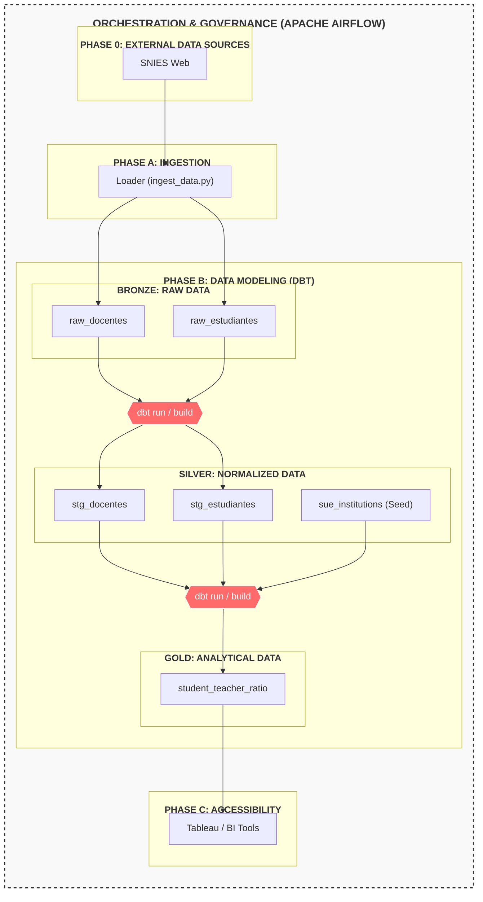

# SNIES Data Challenge

Automated system to monitor the academic capacity of Higher Education Institutions (HEIs) in Bogotá using SNIES Open Data.

## 📊 Architecture Overview

The project follows a **Medallion Architecture** (Bronze, Silver, Gold Layers) and uses **Prefect** for orchestration and **dbt** for transformations.



## 🚀 Getting Started

### Prerequisites
- Docker & Docker Compose
- Docker Desktop with **WSL 2 Integration** enabled.

### Execution
1.  **Build and Start Containers:**
    ```bash
    docker compose up -d --build
    ```
2.  **Verify Services:**
    - Prefect UI: `http://localhost:4200`
    - Postgres: `localhost:5432`

## 🛠 Tech Stack
- **Database:** PostgreSQL (OLAP)
- **Orchestration:** Prefect
- **Data Transformation:** dbt-core
- **Ingestion:** Python (Pandas + SQLAlchemy)
- **DevOps:** Docker & Docker Compose

## 📈 Key Metrics
- **Student-to-Teacher Ratio:** Calculated across HEIs in Bogotá (2022-2024).
- **SUE Classification:** Identification of State University System institutions.
